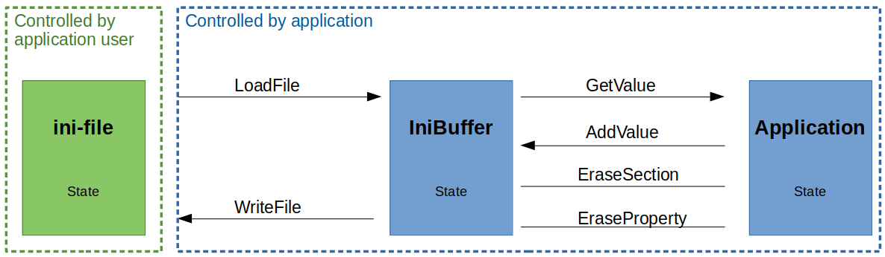

# IniBuffer [](https://travis-ci.org/pascalenderli/IniBuffer)
This is a C++ class, which exposes a public interface to work with an ini configuration file. There are functionalities to read or write a file or to manipulate the content in the buffer. The buffer is developed by considering user friendliness, simplicity performance, platform independence and proper error handling. Only the standard library is used (C++11).

## Background
Ini files are simple and human readable configuration files. They are widely used in computer applications to store system configurations on the hard-disk. The structure is handy to pass groups of data to their intended destinations inside an application.

## Format
The ini format is not well defined. Different systems interpret the files slightly differently or support unequal features.
This file parser is optimized for simple usage and does only support a minimal but sufficient set of ini-file features.

In general an ini-file consists of Sections and Properties.

### Sections
Section names are parenthesized with square brackets to the left and right of the unique name string. Each section can be empty or is followed by a set of properties (key|value pairs). Section names can contain white spaces in between words. White spaces in front of the first letter or after the last letter are ignored. Even though this buffer supports using white spaces in section name strings, doing this is considered bad practice.

#### Valid Sections:

```text
[Section]
[  Section  ] -> Equivalent to:  [Section]
[A_Section]
[A Section]
[]
["  "]
[1]
```
#### Invalid Sections:
```text
Section
[Section
Section ]
]Section[
```

### Properties
Properties are key|value pairs which belong to a section. This parser does only support ini-files which contain at least one section. Therefore properties must belong to a section. The parser ignores any amount of white spaces in front or after keys or values. White spaces in between key names are not valid. Whit spaces in values are valid and belong to the value string.

#### Valid  Properties:
```text
key1=value
an_int = 7
name = Alice
 another_name   = Bob
pi = 3.1415
switch = true
```
#### Invalid  Properties:
```text
price of a phone = 1000
```
### Comments
Comments start with a '#' or a ';'. Everything to the right to one of the two delimiters is considered as comment and is ignored by the parser.

### Valid ini-file Example
shapes.ini
```text
# I an a dummy ini-file.
# I am not pretty but I show some ini specific stuff.
; A not so necessary comment :-P

[Circle]           # A Shape.
Diameter = 700     ; A comment.
Color = red
has_edges = false

[ Square ]         # Another comment.
color= "green"
material = wood
has_edges=true
```

## Interface Usage
The public functions are described below. If a key or section is duplicated, the values are overwritten. A feature of this IniBuffer is the automatic type casting of parsed values.



### Constructor
Constructs an empty IniBuffer object.
```cpp
IniBuffer();
```

### Loading a File from Disk
Parses a given ini-file into the buffer.
Integer, floats, and bools (true, false, TRUE, FALSE, True, False) are automatically type casted to its proper types. All other values are treated as strings.
```cpp
void LoadFile(const std::string& fullfilename);
```

### Writing a File to Disk
Writes the whole content of the buffer to an ini-file on the disk.
```cpp
void WriteFile(const std::string& fullfilename) const;
```

### Clearing the Buffer
Removes all data in the buffer.
```cpp
void Clear() noexcept;
```

### Returning a Value from the Vuffer
A value can be requested from the ini-file buffer to store it in another variable. In order to do this, the function GetValue must be called. It accepts two arguments used to locate the value. The section name and the key name. This function casts the value automatically to the type of the variable. If the requested type does not match the type of the value, an exception is thrown. The supported data-types are bool, int, float and std::sting.
```cpp
template<typename ValueT>
ValueT GetValue(const std::string& section_name, const std::string& key_name) const;
```

### Adding or Updating a Value in the Buffer
Adds a new value to the buffer. Any of the supported data types can be passed. The supported data types are bool, int, float and std::sting.
```cpp
template<typename ValueT>
void AddValue(const std::string& section_name, const std::string& key_name, const ValueT& value);
```

### Deleting a Section or a Property
Given the section and property names, entries are erased from the buffer.
```cpp
void EraseSection(const std::string& section_name) noexcept;
void EraseProperty(const std::string& section_name, const std::string& key_name) noexcept;
```

## Exceptions
The Class returns an Exception of type IniException if something goes wrong.
The what() methods returns a meaningful error message of the form: `[IniBufferException][File: <filename>][Line: <line_nr>][What: <message>]`

```cpp
try
{
    IniBuffer ini;
    ini.LoadFile("../data/test.ini");
    ini.AddValue("added_test_section", "key_100", std::string("a text"));
    ini.WriteFile("../results/test_result.ini");
}
catch(IniException& e)
{
    std::cout<<e.what()<<'\n';
}
```

## Example

```cpp
try
{
    IniBuffer ini;
    ini.LoadFile("shapes.ini");
    ini.AddValue("Circle", "material", std::string("stone"));
    ini.WriteFile("shapes_copy.ini");

    int d = ini.GetValue<int>("Cercle", "Diameter");
    std::string c = ini.GetValue<std::string>("Cercle", "Solor");
    std::cout<<"Diameter: "<<d<<"\n"<<"color: "<<c<<"\n";
}
catch(IniException& e)
{
    std::cout<<e.what()<<'\n';
    abort();
}
```
```text
$ g++ main.cpp -O3
$ ./a.out
Diameter: 700
Color: red
```
